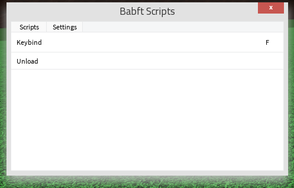
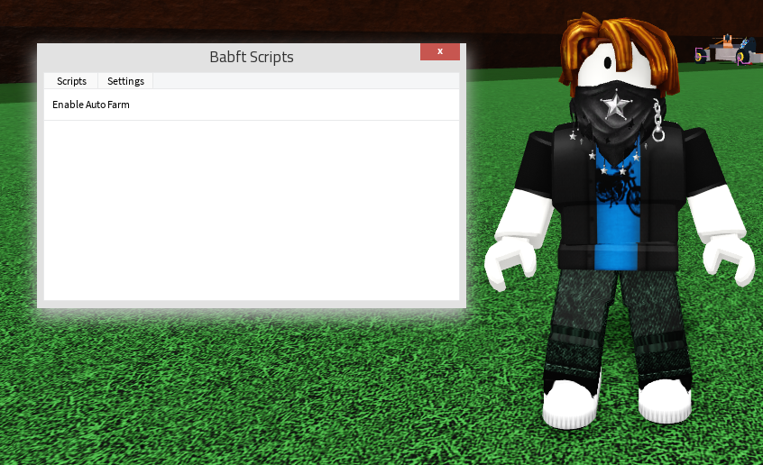

# BabftAutoFarmScript
* How do i use it?
  - First execute enabler.lua then execute babft.lua
* Yes i know this is very easy to do its just for the skids bra
* Script tested on: Potassium
* Showcase
# IF IT WORKS DONT TOUCH IT!!!
 * I forgot to make it so it anchors the humanoidrootpart so u dont acciedently fall off but IT WORKS! (If u dont touch any keybinds to your move keys)
  
  
